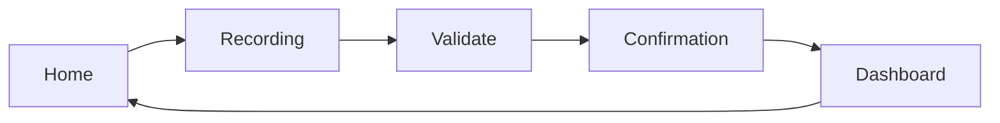

# Audiogami Demo App - Voice Support Tickets

> A demonstration SPA showcasing how Audiogami transforms voice descriptions into structured support tickets with Human-in-the-Loop (HITL) validation.

[](https://reactjs.org/)
[](https://vitejs.dev/)
[](https://tailwindcss.com/)
[](LICENSE)

---

## 📋 Table of Contents

- [Overview](#overview)
- [Features](#features)
- [Use Cases](#use-cases)
- [Getting Started](#getting-started)
- [Project Structure](#project-structure)
- [Workflow](#workflow)
- [Technical Stack](#technical-stack)
- [Data Models](#data-models)
- [Screenshots](#screenshots)
- [Development](#development)
- [Deployment](#deployment)
- [Contributing](#contributing)
- [Changelog](#changelog)

---

## 🎯 Overview

This application demonstrates the core value proposition of Audiogami: converting unstructured voice input into structured, actionable support tickets. The demo simulates a two-pass voice processing system where:

1. **Pass 1**: User describes their problem naturally - the system extracts key information
2. **Pass 2**: System asks targeted follow-up questions for missing details
3. **HITL**: User validates and completes the extracted information
4. **Confirmation**: Ticket is created and assigned to an appropriate agent

**Phase 1 Status**: This is a simulation using pre-recorded transcripts. No real SDK or voice processing is integrated yet.

---

## ✨ Features

### Core Capabilities

- ✅ **4 Industry Use Cases** - IT Support, E-commerce, SaaS, Developer Portal
- ✅ **Bilingual Interface** - Full FR/EN support with instant switching
- ✅ **Smart Field Extraction** - Progressive information capture across 2 passes
- ✅ **HITL Validation** - Editable forms with required/optional field grouping
- ✅ **Auto-categorization** - Intelligent priority and category assignment
- ✅ **Tag System** - Smart tagging (urgent, recurring, VIP, etc.)
- ✅ **Agent Assignment** - Visual agent cards with estimated response times
- ✅ **Knowledge Base** - Contextual article suggestions per use case
- ✅ **Dashboard** - Full back-office with search, filter, and export

### UX Enhancements

- 🎨 Modern, responsive design with Tailwind CSS
- ⚡ Fast typewriter effect for realistic transcription simulation
- 📊 Visual progress bars with color-coded states
- 🎭 Smooth animations and transitions
- 📱 Mobile-first responsive layout
- 🌐 Persistent language preference

### Technical Features

- 💾 LocalStorage persistence (no backend required)
- 🔄 Real-time form validation
- 📤 CSV export for ticket data
- 🎯 Modular component architecture
- ⚙️ Production-ready build configuration
- 🚀 Hot Module Replacement (HMR) in development

---

## 🏢 Use Cases

### 🖥️ IT Support - PC Expert Support
**Context**: Gaming PC retailer providing technical support

**Questions**:
1. Quel appareil ou composant pose problème ? / Which device or component is having issues?
2. Que se passe-t-il exactement ? / What exactly is happening?
3. Depuis quand et à quelle fréquence ? / Since when and how often?

**Categories**: Hardware, Software, Network, Peripheral, Other

**Sample Issues**: Graphics card crashes, keyboard malfunction, driver issues

---

### 👟 E-commerce - ShoeShop Support
**Context**: Online shoe store handling orders and deliveries

**Questions**:
1. Quel est votre numéro de commande ? / What is your order number?
2. Quel problème rencontrez-vous ? / What problem are you experiencing?
3. Avez-vous déjà contacté le transporteur ? / Have you already contacted the carrier?

**Categories**: Delivery, Product Defect, Wrong Item, Refund, Other

**Sample Issues**: Missing package, wrong size received, delayed delivery

---

### 📊 SaaS - CRM Helper
**Context**: CRM software technical support

**Questions**:
1. Quelle fonctionnalité est concernée ? / Which feature is affected?
2. Décrivez le comportement inattendu / Describe the unexpected behavior
3. Quel est l'impact sur votre travail ? / What is the impact on your work?

**Categories**: Bug, Feature Request, Access Issue, Performance, Other

**Sample Issues**: PDF export timeout, missing date filters, login problems

---

### 💻 Dev Portal - DevPortal Feedback
**Context**: Developer portal for API users

**Questions**:
1. S'agit-il d'un bug, d'une idée ou d'une question ? / Is it a bug, an idea, or a question?
2. Décrivez précisément la situation / Describe the situation precisely
3. Quelle est l'urgence pour vous ? / What is the urgency for you?

**Categories**: Bug, Enhancement, New Feature, Documentation, Other

**Sample Issues**: Double-click creates duplicates, OAuth docs incomplete

---

## 🚀 Getting Started

### Prerequisites

- Node.js 18+ and npm 9+
- Modern web browser (Chrome, Firefox, Safari, Edge)
- Git

### Installation

```bash
# Clone the repository
git clone https://github.com/gami-lab/voice-support-claude.git
cd voice-support-claude

# Install dependencies
npm install
```

### Development Server

```bash
# Start Vite dev server with HMR
npm run dev

# Server will start at http://localhost:5173
```

Open your browser and navigate to `http://localhost:5173`

### Production Build

```bash
# Create optimized production build
npm run build

# Preview production build locally
npm run preview
```

Build output will be in the `dist/` directory.

---

## 📁 Project Structure

```
voice-support-claude/
│
├── src/
│   ├── components/           # Reusable UI components
│   │   ├── Header.jsx        # App header with branding & language toggle
│   │   └── Footer.jsx        # Footer with Audiogami attribution
│   │
│   ├── screens/              # Page-level route components
│   │   ├── Home.jsx          # Landing page with use case selection
│   │   ├── Recording.jsx     # Voice simulation with typewriter effect
│   │   ├── Validate.jsx      # HITL form validation screen
│   │   ├── Confirmation.jsx  # Success screen with agent assignment
│   │   └── Dashboard.jsx     # Back-office ticket management
│   │
│   ├── data/                 # Static data and configurations
│   │   ├── enums.js          # Status, Priority, Category, Tag enums
│   │   ├── transcriptions.js # Pre-recorded voice transcripts (FR/EN)
│   │   ├── useCases.js       # Use case configs, questions, KB articles
│   │   └── translations.js   # i18n strings for FR/EN
│   │
│   ├── hooks/                # Custom React hooks
│   │   └── useLanguage.jsx   # Language context provider & switcher
│   │
│   ├── utils/                # Utility functions
│   │   └── storage.js        # LocalStorage CRUD + seed data generator
│   │
│   ├── App.jsx               # Root component with routing
│   ├── main.jsx              # React 19 entry point
│   └── index.css             # Global styles, Tailwind directives, animations
│
├── public/                   # Static assets
│   └── vite.svg
│
├── dist/                     # Production build output (generated)
│
├── node_modules/             # Dependencies (generated)
│
├── README.md                 # This file
├── CHANGELOG.md              # Version history and release notes
├── package.json              # NPM dependencies and scripts
├── package-lock.json         # Dependency lock file
├── vite.config.js            # Vite bundler configuration
├── tailwind.config.js        # Tailwind CSS configuration
├── postcss.config.js         # PostCSS plugins (Tailwind + Autoprefixer)
├── eslint.config.js          # ESLint linting rules
├── .gitignore                # Git ignore patterns
└── index.html                # HTML entry point
```

---

## 🔄 Workflow

### User Journey (4 Screens)



#### 1. **Home Screen** - Use Case Selection
- Display 4 use case cards with icons and descriptions
- Show 3-step process overview
- Link to dashboard for viewing existing tickets

#### 2. **Recording Screen** - Voice Simulation
- Show use case questions
- **Test Pass 1**: Play first transcript with typewriter effect
- Display detected fields in real-time
- Highlight missing required fields
- **Test Pass 2**: Play follow-up transcript
- Complete remaining fields
- Auto-navigate to validation

#### 3. **Validate Screen** - HITL Form
- Editable form with all extracted fields
- Required fields clearly marked
- Dropdowns for enums (status, priority, category)
- Tag selection with chip UI
- Completion status indicator
- Option to return to recording or validate & continue

#### 4. **Confirmation Screen** - Success & Assignment
- Ticket summary with color-coded badges
- 3 available agents with specialty and estimated time
- Knowledge base article suggestions
- Optional email notification
- Create ticket and redirect options

#### 5. **Dashboard** - Back Office
- Statistics cards by status
- Category breakdown
- Search and filter controls
- Sortable ticket table
- Click to view full ticket details
- CSV export

---

## 🛠️ Technical Stack

### Frontend Framework
- **React 19.0.0** - Component-based UI library with latest features
- **React Router 7.1.1** - Client-side routing and navigation
- **Vite 7.2.6** - Next-generation build tool with lightning-fast HMR

### Styling
- **Tailwind CSS 4.0.0** - Utility-first CSS framework
- **PostCSS 8.4.49** - CSS transformations
- **Autoprefixer 10.4.20** - Automatic vendor prefixing

### State Management
- React Context API for language preferences
- React useState/useEffect for component state
- LocalStorage for persistent data

### Development Tools
- **ESLint 9.17.0** - Code quality and consistency
- **Vite Plugin React 4.3.4** - Fast Refresh support

### Future Backend (Prepared)
- **Supabase Client 2.48.1** - Ready for Phase 2 integration

---

## 📊 Data Models

### Ticket Schema

```javascript
{
  id: string,                    // UUID
  created_at: string,            // ISO 8601 timestamp
  use_case: enum,                // it_support | ecommerce | saas | dev_portal
  status: enum,                  // new | in_progress | waiting_customer | resolved | closed
  priority: enum,                // critical | high | medium | low
  category: enum,                // Use case specific categories
  tags: string[],                // Array of tag enums
  raw_transcript: string,        // Complete voice transcript
  language: string,              // 'fr' | 'en'
  email: string,                 // Optional user email

  // Use case specific fields (nullable)
  device: string,
  symptoms: string,
  frequency: string,
  environment: string,
  actions_tried: string,
  impact: string,
  order_number: string,
  problem_type: string,
  product_description: string,
  delivery_status: string,
  desired_resolution: string,
  purchase_date: string,
  feature: string,
  steps_to_reproduce: string,
  request_type: string,
  description: string,
  urgency: string,
  context: string,
  expected_behavior: string,
  ideas_needs: string
}
```

### Enums Reference

**Status**: `new`, `in_progress`, `waiting_customer`, `resolved`, `closed`

**Priority**: `critical`, `high`, `medium`, `low`

**Tags**: `urgent`, `recurring`, `first_contact`, `escalation`, `vip_customer`, `workaround_available`

**Categories by Use Case**:
- IT Support: `hardware`, `software`, `network`, `peripheral`, `other`
- E-commerce: `delivery`, `product_defect`, `wrong_item`, `refund`, `other`
- SaaS: `bug`, `feature_request`, `access_issue`, `performance`, `other`
- Dev Portal: `bug`, `enhancement`, `new_feature`, `documentation`, `other`

---

## 🖼️ Screenshots

### Home - Use Case Selection
Select from 4 different support scenarios with visual cards and icons.

### Recording - Voice Simulation
Watch as the system "listens" and progressively extracts information with a realistic typewriter effect.

### Validation - HITL Form
Review and complete extracted information in an editable, user-friendly form.

### Confirmation - Success
See ticket summary, assigned agent, and helpful knowledge base articles.

### Dashboard - Back Office
Manage all tickets with powerful filtering, search, and export capabilities.

---

## 👨‍💻 Development

### Available Scripts

```bash
# Development server with HMR
npm run dev

# Production build
npm run build

# Preview production build
npm run preview

# Lint code
npm run lint
```

### Environment Variables

Currently no environment variables required. For Phase 2 with Supabase:

```env
VITE_SUPABASE_URL=your_supabase_url
VITE_SUPABASE_ANON_KEY=your_supabase_anon_key
```

### Adding New Use Cases

1. Define enums in `src/data/enums.js`
2. Add configuration in `src/data/useCases.js`
3. Create transcriptions in `src/data/transcriptions.js`
4. Add translations in `src/data/translations.js`

### Adding New Languages

1. Add translations object in `src/data/translations.js`
2. Add transcription variants in `src/data/transcriptions.js`
3. Update language switcher in `src/components/Header.jsx`

---

## 🚢 Deployment

### Build for Production

```bash
npm run build
```

### Deploy to Vercel

```bash
npm install -g vercel
vercel
```

### Deploy to Netlify

```bash
npm run build
# Drag and drop the 'dist' folder to Netlify
```

### Deploy to GitHub Pages

```bash
npm run build
# Configure GitHub Pages to serve from 'dist' directory
```

### Environment Configuration

The app works out of the box with no backend. For production with Supabase:

1. Create Supabase project
2. Set environment variables
3. Update `src/lib/supabase.js` (to be created in Phase 2)
4. Migrate from localStorage to Supabase client

---

## 🤝 Contributing

This is a demonstration project for Audiogami. For questions or feedback:

1. Open an issue describing your feedback
2. Fork the repository
3. Create a feature branch
4. Submit a pull request with detailed description

---

## 📝 Changelog

See [CHANGELOG.md](CHANGELOG.md) for detailed version history and release notes.

**Latest Version**: 1.0.0 (2025-12-01)

---

## 📄 License

This project is proprietary software built for Audiogami. All rights reserved.

---

## 🙏 Acknowledgments

- **Audiogami Team** - For the innovative voice-to-ticket concept
- **React Team** - For the amazing framework
- **Tailwind CSS** - For the utility-first styling approach
- **Vite** - For blazing fast development experience

---

## 📞 Support

For technical support or questions:
- Open an issue on GitHub
- Contact: [Audiogami Support](mailto:support@audiogami.com)

---

**Built with ❤️ for Audiogami** | **Powered by React + Vite + Tailwind CSS**
